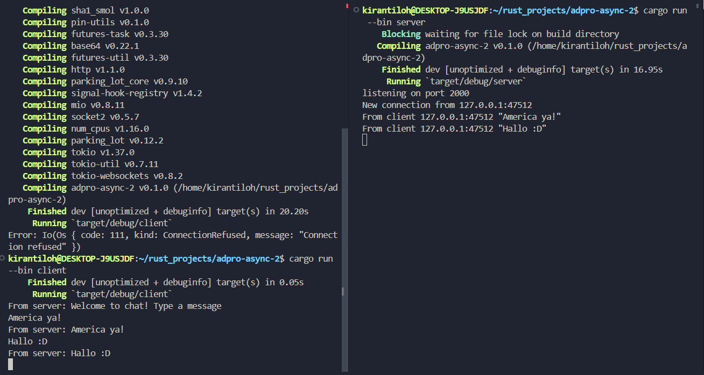

### Reflection 1

Terdapat 2 file yang bertugas sebagai server dan client. Ketika client mengirimkan pesan lewat terminal maka server akan membalas apa yang dikirimkan oleh client dan log dari mana datangnya pesan tersebut.

#### Reflection 2
Ketika client mengganti connection port menjadi 8080 terjadi error karena pada port 8080 tidak ada server websocket. Hal ini terjadi karena server websocket terdapat pada port 2000. Untuk membuat client connect setelah mengganti port server websocket, kita perlu mengganti port pada file `server.rs` di baris 47. 

#### Reflection 3

Untuk memasukkan IP dan Port dari pengirim, kita hanya perlu format pesan agar memasukkan port dan IP pada line 29 di `server.rs`. 